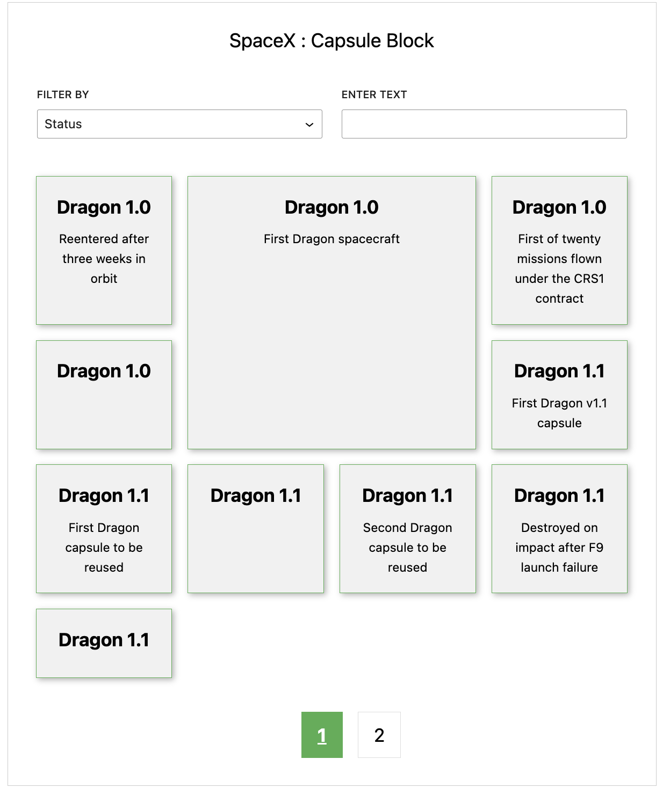

# Arun-Chaitanya-Jami-Frontend-Developer

Plugin that retrieves data from a SpaceX API, and makes an admin-only accessible Block with filters to search data and displays data in grid style.

## Compatibility

WordPress 5.9 - 6.2

PHP 7.4 - 8.1

## ScreenShot

## Development

In order to start your development environment you will need to install the following tools on your host machine:

- Git

- Docker

- Docker Compose

You will also need to add a hosts entry to the host machine as follows if you which you use separate domain for local instance:

`127.0.0.1 localhost`

Then you can run:

`./local`

This will start a local Docker development environment including any necessary dependencies such as the MySQL database and web server. Once complete, you should be able to access the local environment via `http://localhost` in your web browser.

Several dev dependencies are managed via Composer. After running the `./local` command you should complete the WP steps.

You can also run Composer commands directly from your host machine but you may not be using the same version of PHP as is used in the project so you may need to ignore platform dependencies.

### Linting via IDE

In order to setup linting via an IDE, you can either use the docker-compose file in an IDE such as PHPStorm ensuring you have Docker installed and configured and set the rules using the phpcs.xml file. You can also install PHP and PHPCS on your local machine and configure your IDE accordingly.

### Troubleshooting

If you run into any difficulties bringing up the local development environment you can run `./local reset`. This will rebuild the Docker images as well as deleting all volumes and running containers. This may be required if the Docker configuration has been changed.
